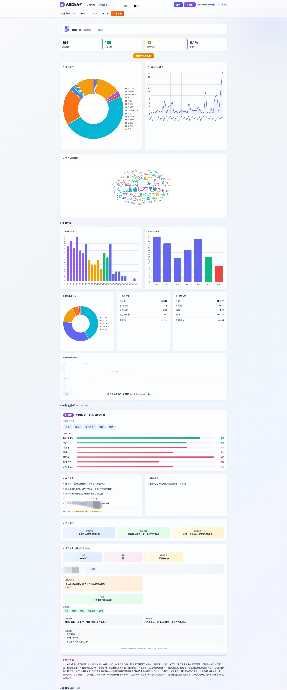

# hupu-bot

虎扑论坛命令行工具 + Web 分析平台，支持回复帖子、获取消息、抓取回帖/发帖数据、相似度分析、AI 智能分析。

## 功能

- **回复帖子**: 向指定帖子发送回复，支持引用回复
- **点赞回复**: 点赞/取消点赞某条回复
- **搜索帖子**: 搜索虎扑帖子，支持板块过滤和排序
- **获取消息**: 查看"提到我的"、"评论"、"亮了/推荐"等消息通知
- **板块帖子**: 获取指定板块的帖子列表
- **帖子详情**: 获取帖子正文内容和热门回复（按点赞排序）
- **获取回帖**: 抓取用户的所有回帖记录并存入数据库
- **获取发帖**: 抓取用户的发帖记录并存入数据库
- **相似度分析**: 分析用户回帖中的重复/近似内容，识别复读模式
- **AI 智能分析**: 基于 DeepSeek API 对用户的回帖/发帖进行深度画像分析
- **Web 可视化**: 启动 Web 服务，通过图表、词云、AI 分析报告等形式展示数据

## 安装

```bash
cd hupu-bot
cargo build --release
```

## 配置

复制配置文件并填入你的凭据：

```bash
cp config.example.json config.json
```

```json
{
  "cookie": "smidV2=...; u=...; csrfToken=...; ...",
  "deepseek_api_key": "sk-..."
}
```

| 字段 | 必填 | 说明 |
|------|------|------|
| `cookie` | 是 | 虎扑登录 Cookie，从浏览器 DevTools 复制，需包含 `smidV2` 字段 |
| `deepseek_api_key` | 否 | DeepSeek API Key，用于 AI 智能分析功能 |

> `puid` 和 `shumei_id` 会自动从 cookie 中的 `u` 和 `smidV2` 字段解析，无需手动配置。

### 获取 Cookie

**推荐方式 — 自动提取：**

```bash
cargo run -- extract-cookies
```

程序会自动查找系统中的 Chrome 或 Edge 浏览器，启动调试窗口打开虎扑论坛，你只需登录虎扑账号，Cookie 会自动保存到 `config.json`。

> **Windows**: 自动从注册表获取浏览器安装路径，并提示关闭后台运行的浏览器进程以确保调试端口可用。
> **macOS**: 从标准 Applications 路径查找浏览器，同样支持关闭后台进程。
> **手动方式**（自动提取失败时）：

1. 打开 Chrome 浏览器，登录虎扑
2. 按 F12 打开开发者工具
3. 切换到 Network 标签
4. 刷新消息页面 `https://my.hupu.com/message?tabKey=1`
5. 找到任一请求，查看 Headers
6. 复制 Cookie 整行（从 `smidV2=...` 开始到结尾）

## 使用

### 自动提取 Cookie

自动从 Chrome/Edge 浏览器提取虎扑登录 Cookie，无需手动复制。

```bash
cargo run -- extract-cookies
```

**工作流程**:
1. 检测是否已有带调试端口的浏览器在运行，有则直接提取
2. 在系统中查找 Chrome 或 Edge 浏览器的安装路径
3. 检测并提示关闭浏览器后台进程（需用户确认）
4. 启动浏览器调试窗口，自动打开虎扑论坛
5. 等待登录完成（检测到 `smidV2` 字段即为登录成功）
6. 自动提取 Cookie 并保存到 `config.json`

**注意事项**:
- 如果浏览器已经在运行，后台进程会阻止调试端口开启，程序会提示你确认关闭进程
- 登录超时时间为 5 分钟，超时后需要重新运行
- Cookie 中的 `puid` 和 `shumei_id` 会自动解析
- 已有的 `deepseek_api_key` 等配置会被保留

### 点赞回复

```bash
# 点赞某条回复
cargo run -- like -p 638074156 -c 201801 -f 278

# 取消点赞
cargo run -- like -p 638074156 -c 201801 -f 278 --undo
```

**参数说明**:
- `-p, --tid`: 帖子 ID
- `-c, --pid`: 回复 ID（要点赞的那条回复的 pid）
- `-f, --fid`: 板块 ID（如 278 汽车区）
- `-u, --undo`: 取消点赞

### 搜索帖子

```bash
# 基本搜索（默认综合排序）
cargo run -- search -k "特斯拉"

# 指定页码和条数
cargo run -- search -k "小米汽车" -p 2 -l 10

# 指定板块过滤
cargo run -- search -k "比亚迪" --forum 278

# 按排序方式
cargo run -- search -k "问界" -s light

# JSON 格式输出
cargo run -- search -k "华为" -f json
```

**参数说明**:
- `-k, --keyword`: 搜索关键词（必填）
- `-p, --page`: 页码（默认 1）
- `-l, --limit`: 限制条数（默认 20）
- `-f, --format`: 输出格式（table / json / simple）
- `--forum`: 板块 ID 过滤
- `-s, --sort`: 排序方式（默认 `general`）
  - `general`: 综合
  - `createtime`: 最新
  - `createtimeasc`: 最早
  - `replytime`: 回复时间
  - `light`: 亮回复数
  - `reply`: 回复数

### 回复帖子

```bash
# 普通回复
cargo run -- reply -t 1 -p 638852430 -c "这是我的回复内容"

# 回复指定发言（引用回复）
cargo run -- reply -t 1 -p 638852430 -c "回复你的发言" -q 201801
```

**参数说明**:
- `-t, --topic-id`: 板块 ID（如 1）
- `-p, --tid`: 帖子 ID（URL 中的数字）
- `-c, --content`: 回复内容
- `-q, --quote-id`: 引用回复ID（可选），对应被引用发言的 `pid`

**字段映射说明**:

| 字段名 | 所在位置 | 含义 | 用法 |
|--------|---------|------|------|
| `pid` | mentions API 返回 | 发言/回复的唯一标识 | 从消息列表中获取，用于定位要回复的具体发言 |
| `quoteId` | createReply API 请求 | 被引用发言的 ID | 发送回复时，填入对方的 `pid`，实现引用回复 |

流程示例：
1. 通过 `cargo run -- mentions --format json` 获取消息列表
2. 从 JSON 中找到目标消息的 `pid` 字段（如 `"pid": xxxxxx`）
3. 使用 `-q xxxxx` 参数回复该指定发言

```bash
# 1. 先获取消息，记录 pid
$ cargo run -- mentions --format json
[
  {
    "username": "某用户",
    "content": "原始发言内容",
    "tid": 638852430,
    "pid": xxxxx    # ← 记录这个 pid
  }
]

# 2. 使用 pid 作为 quote-id 回复
$ cargo run -- reply -t 1 -p 638852430 -c "回复内容" -q xxxxx
```

### 获取消息

```bash
# 获取"提到我的"消息（默认20条）
cargo run -- mentions

# 获取"评论"消息
cargo run -- mentions --tab comments

# 获取"亮了/推荐"消息
cargo run -- mentions --tab likes

# 过滤24小时内的消息
cargo run -- mentions --since 24h

# 过滤7天内的消息
cargo run -- mentions --since 7d

# 最多获取50条消息
cargo run -- mentions --limit 50

# 最多翻3页获取消息
cargo run -- mentions --pages 3

# JSON 格式输出
cargo run -- mentions --format json

# 组合使用
cargo run -- mentions --tab comments --since 48h --limit 10 --format simple
```

**参数说明**:
- `-t, --tab`: 消息类型
  - `mentions`: 提到我的（默认）
  - `comments`: 评论
  - `likes`: 亮了/推荐
- `-s, --since`: 时间过滤
  - `24h`: 24小时内
  - `48h`: 48小时内
  - `7d`: 7天内
  - `2026-03-20`: 指定日期之后
- `-l, --limit`: 限制条数（默认 20）
- `-p, --pages`: 最大翻页数（默认 5）
- `-f, --format`: 输出格式
  - `table`: 表格格式（默认）
  - `json`: JSON 格式
  - `simple`: 简洁列表格式

## Tab 类型说明

| Tab | TabKey | 说明 |
|-----|---------|------|
| 提到我的 | 1 | 有人回复了你的回复（二级互动） |
| 评论 | 2 | 有人回复了你的帖子（一级评论） |
| 亮了/推荐 | 3 | 有人点赞/推荐了你的内容 |

### 获取板块帖子 / 帖子详情

```bash
# 获取板块帖子列表（如汽车区 278）
cargo run -- topic --id 278

# 指定页码和条数
cargo run -- topic --id 278 --page 1 --limit 10

# 获取帖子详情（9位帖子ID自动识别）
cargo run -- topic --id 638890883 --detail

# 获取帖子详情和热门回复
cargo run -- topic --id 638890883 --detail --replies 20

# JSON 格式输出
cargo run -- topic --id 278 --format json
cargo run -- topic --id 638890883 --detail --format json
```

**参数说明**:
- `-i, --id`: 板块 ID（如 278）或帖子 ID（9位数字）
- `-p, --page`: 页码（默认 1）
- `-l, --limit`: 帖子条数（默认 20）
- `-f, --format`: 输出格式（table / json / simple）
- `-d, --detail`: 获取帖子详情（仅帖子ID时有效）
- `-r, --replies`: 热门回复条数（默认 10，配合 --detail 使用）

**常见板块 ID**:
| 板块 | ID |
|------|-----|
| 汽车区 | 278 |
| 萌宠区 | 34 |
| 数码区 | 1161 |
| 篮球区 | 2 |
| 步行街 | 1 |

### 获取回帖

抓取用户的所有回帖记录并存入 SQLite 数据库，供后续分析使用。

```bash
# 获取用户回帖（默认10页，每页10条）
cargo run -- replies -e 27066519444214

# 获取更多页
cargo run -- replies -e 27066519444214 -p 20 -s 20

# JSON 格式输出
cargo run -- replies -e 27066519444214 -f json
```

**参数说明**:
- `-e, --euid`: 用户加密 UID（从个人主页 URL 获取）（必填）
- `-p, --max-pages`: 最大获取页数（默认 10）
- `-s, --page-size`: 每页条数（默认 10）
- `-f, --format`: 输出格式（table / json / simple）

**euid 获取方式**: 打开用户个人主页 `https://my.hupu.com/{euid}`，URL 路径中的数字即为 euid。

### 获取发帖

抓取用户的发帖（主题帖）记录并存入 SQLite 数据库。

```bash
# 获取用户发帖
cargo run -- posts -e 27066519444214

# 获取更多页
cargo run -- posts -e 27066519444214 -p 5

# JSON 格式输出
cargo run -- posts -e 27066519444214 -f json
```

**参数说明**:
- `-e, --euid`: 用户加密 UID（必填）
- `-p, --max-pages`: 最大获取页数（默认 5）
- `-f, --format`: 输出格式（table / json / simple）

发帖数据从用户个人主页 HTML 中提取，包含标题、摘要、板块、回复数、浏览量、点亮数、图片/视频标记等。

### 相似度分析

分析用户回帖中的重复/近似内容，使用 Jaccard 相似度算法进行聚类。

```bash
# 分析回帖相似度（默认阈值 0.5）
cargo run -- analyze -e 27066519444214

# 使用更高阈值（更严格，只匹配高度相似的内容）
cargo run -- analyze -e 27066519444214 -t 0.8

# JSON 格式输出
cargo run -- analyze -e 27066519444214 -f json
```

**参数说明**:
- `-e, --euid`: 用户加密 UID（必填）
- `-t, --threshold`: Jaccard 相似度阈值，0~1（默认 0.5）
  - 值越大越严格，只匹配高度相似的内容
  - 值越小越宽松，会匹配更多近似内容
- `-f, --format`: 输出格式（table / json / simple）

**算法说明**:
1. 对每条回帖进行中文分词（overlapping bigram）和英文 token 化
2. 计算两两之间的 Jaccard 相似度
3. 使用 Union-Find 算法聚类
4. 对非精确匹配组进行 centroid 验证，防止传递链误聚合
5. 输出每个相似组的代表内容、出现次数、板块分布

### Web 可视化服务

启动 Web 服务，以可视化图表和 AI 分析报告的形式展示数据。

```bash
# 启动 Web 服务（默认端口 3000）
cargo run -- serve

# 指定端口
cargo run -- serve -p 8080
```

**参数说明**:
- `-p, --port`: 端口号（默认 3000）

启动后打开浏览器访问 `http://localhost:3000`，功能包括：

#### 回帖分析
- **统计概览**: 总回帖数、独立回帖、重复/相似回帖、重复率
- **板块分布**: 各板块回帖数的环形图
- **月度趋势**: 月度发帖量的折线图
- **词云**: 高频词可视化（基于 jieba 分词）
- **深度分析**:
  - 时段活跃度（24小时分布）
  - 周活跃分布
  - 回帖长度分布
  - 点亮统计（总点亮、平均点亮、最高点亮）
  - 回帖最多的帖子排行
- **相似回帖组**: 展示聚类结果，可展开查看每条详情
- **AI 智能分析**: 基于 DeepSeek 的用户画像（关注领域、立场倾向、核心观点、行为模式）

#### 发帖数据
- **统计概览**: 总发帖数、总回复、总浏览、总点亮、视频帖数
- **发帖板块分布**: 环形图
- **发帖列表**: 展示标题、板块、视频/图片标记、互动数据
- **AI 智能分析**: 基于 DeepSeek 的发帖画像（内容风格、话题焦点、互动分析）

#### 通用功能
- **导出图片**: 将当前分析结果导出为 PNG 图片
- **相似度阈值调节**: 实时切换相似度阈值查看不同粒度的聚类结果




## 项目结构

```
hupu-bot/
├── Cargo.toml
├── config.json        # 配置文件（Cookie、设备指纹、API Key）
├── config.example.json
├── hupu.db            # SQLite 数据库（自动创建）
├── web/
│   └── index.html     # Web 前端页面（Vue 3 + Chart.js + Tailwind）
└── src/
    ├── main.rs        # 命令行入口，定义 clap 子命令
    ├── client.rs      # HTTP 客户端（headers 配置）
    ├── config.rs      # 配置管理
    ├── api.rs         # 回复/点赞接口
    ├── db.rs          # SQLite 数据库操作（建表、CRUD、查询）
    ├── replies.rs     # 获取用户回帖
    ├── posts.rs       # 获取用户发帖
    ├── analyze.rs     # 回帖相似度分析（Jaccard + Union-Find 聚类）
    ├── deepseek.rs    # DeepSeek AI 分析（回帖画像、发帖画像）
    ├── mentions.rs    # 获取消息通知
    ├── search.rs      # 搜索帖子
    ├── server.rs      # Web 服务（Axum API + 路由）
    ├── topic.rs       # 板块帖子、帖子详情、热门回复
    └── utils.rs       # 工具函数
```

## 开发

```bash
# 编译（开发模式）
cargo build

# 编译（发布模式）
cargo build --release

# 运行
cargo run -- <command> [args...]
```

## 注意事项

1. Cookie 可能会过期，如果遇到登录失败提示，需要重新获取后更新 `config.json`
2. `smidV2` 与你的设备绑定，通常不会经常变化
3. 板块 ID 可以从抓包的 `topicId` 字段获取
4. 帖子 ID 即帖子 URL 中的数字部分
5. AI 分析功能需要配置 `deepseek_api_key`，每次分析会消耗 API 额度
6. 首次使用 `replies` / `posts` 命令会创建 `hupu.db` 数据库文件
7. 回帖数据是 Web 分析的基础，需要先通过 `replies` 命令抓取数据，再启动 Web 服务查看

## License

MIT
